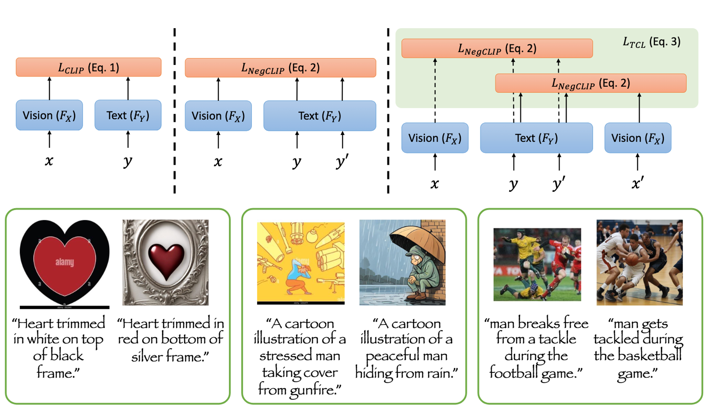

## <div align="center"> [NeurIPS 2024] <i>TripletCLIP </i>: Improving Compositional Reasoning of CLIP via Synthetic Vision-Language Negatives</div>

<div align="center">
  <a href="https://tripletclip.github.io/"></a> &ensp;
  <a href="#"></a> &ensp;
  <a href="https://huggingface.co/spaces/ECLIPSE-Community/ECLIPSE-Kandinsky-v2.2"></a> &ensp;



</div>


This repository will provide the access to dataset, pretrained checkpoints, inference, and training code for our paper, TripletCLIP.
We provide our own training scripts written from scratch to train the models reported in paper and OpenCLIP varient for easy reproducibility.

---

## TODOs:

- [x] ~~Release High-Quality Subset of TripletData.~~
- [ ] Release all pre-trained and finetuned checkpoints. 
- [ ] Release TripletCLIP adaption on OpenCLIP.
- [ ] Release full TripletData.
- [ ] Release original TripletCLIP training scripts for reproducibility.
 

## Citing

If you find the TripletCLIP useful then consider citing:

```bibtex
@article{patel2024tripletclip,
    author = {Patel, Maitreya and Kusumba, Abhiram and Cheng, Sheng and Kim, Changhoon and Gokhale, Tejas and Baral, Chitta and Yang, Yezhou},
    title = {TripletCLIP: Improving Compositional Reasoning of CLIP via Synthetic Vision-Language Negatives},
    journal={Advances in neural information processing systems},
    year = {2024},
}
```

# Acknowledgement:

We would like to acknowledge the excelletn open-source community OpenCLIP, Huggingface, LAION-AI, and OpenAI for their efforts on making CLIP inference/finetuning and benchmarking easily accessible to all.